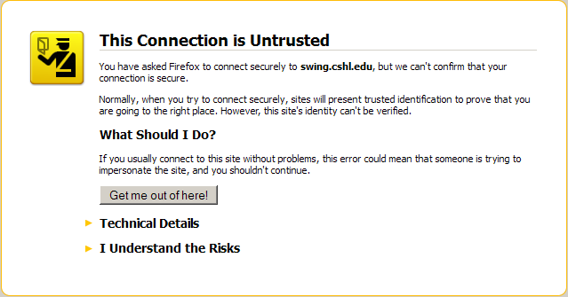
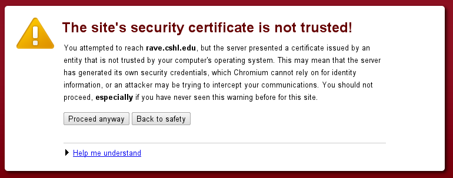
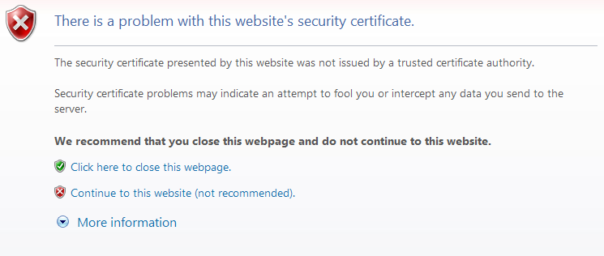

# Installing Root-CA certificate on client devices

Once you generate a Root Certificate Authority (CA), you'll need to distribute
it to your clients (laptops,mobile devices, etc.) - so that every server's certificate
(which is signed by the CA) will be accepted as valid and trusted.

### Generating Certificates

When you generate the Root CA's certificate (to later sign the server's certificate):

```sh
$ ./create_certificate_authoriy.sh
```

A file named `ca_public_certificate.pem` will be created (in `./CA/`).
This is the file which will should be distributed to your clients.

### Distribution of CA certificate

#### Send as email attachment

With most iOS devices, you can simply send this file as an email attachment.
Opening the attachment will start the installation process.

The user will need to manually accept (i.e. trust) the certificate.
See instructions below.

#### Publish the certificate on a website

A simple static website is enough to distribute the CA certificate file.

For most devices, provide a download link for the `ca_publicc_certificate.pem` file.

For MAC/iOS devices, set the MIME type of the file to enable automatic installation,
by adding the following statement to the apache configuration of your download website:

```
	AddType application/x-x509-ca-cert .pem
```

### Instruction for clients

Different operating systems have different installation methods for a Root-CA certificate.

Choose wisely:

* [iPhone/iPad](client_CA_iOS.md)
* [Firefox on Mac/Windows](client_CA_firefox.md)
* [Safari/Chrom on Mac OSX](client_CA_macOSX.md)
* [IE/Chrom on Windows](client_CA_windows.md)
* [IE/Chrom on Windows 7](client_CA_windows7.md)


### Certificate Warnings

If the client does not install the Root CA certificate, he/she will see warnings
when they access an HTTPS server signed by the CA. Warning appear as such:

**Firefox Warnings:**



**Safari Mac OS X Warnings:**


**Chrom Warnings:**



**Internet Explorer Warnings:**



### Security Notes
* It's considered VERY BAD form to educate users to 'just accept and continue' untrusted certificates
from webservers.
* It's probably just as bed edutcating users to trust self-signed Root-CA certificates

