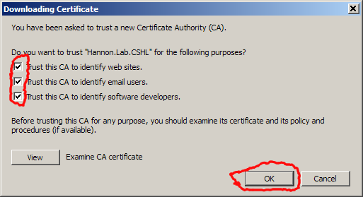

# Adding Root-CA certificate to Firefox (Windows/MAC)

## Preparations

After creating the Root CA certificate (with `./create_certificate_authority.sh`),
give the generated certificate file (`ca_public_certificate.pem`) to the clients' devices
(by providing a downloadable link).

## Installation

### Installation Step 1 - Open Certificate File

Open 'firefox', and browser to the website from which the certificate can be
downloaded. Click on the certificate link.

You'll see the following message:

Mark all the checkboxes and click **OK**.

The certificate is now installed.

## Removal

TODO

## Security Considerations

* Installing (and trusting) any certificate enables all sorts of nasty tricks (e.g man-in-the-middle attacks). This should not be done lightly.
