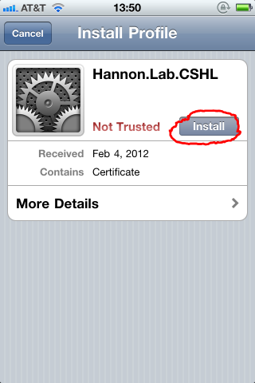
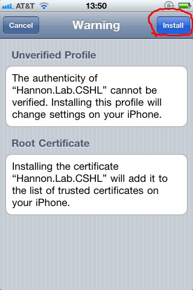
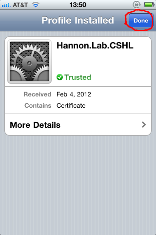
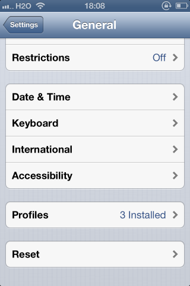
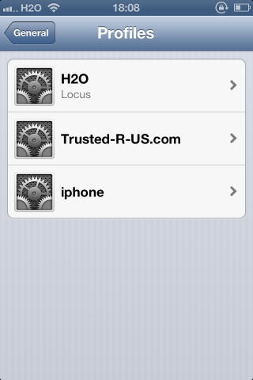
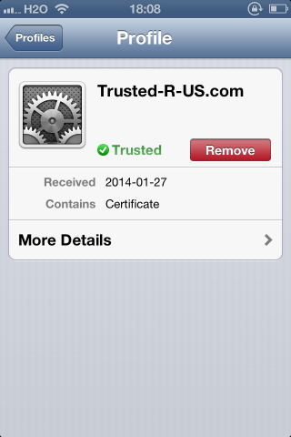

# Adding Root-CA certificate to iOS devices

## Preparations

After creating the Root CA certificate (with `./create_certificate_authority.sh`),
give the generated certificate file (`ca_public_certificate.pem`) to the clients' devices
(by email or by providing a downloadable link).

## Installation

Open the Root-CA certificate file, and follow these steps:

### Installation Step 1 - Open Certificate File

The iPhone will display the following message:

It's OK that the iPhone marks it as **not trusted**, as it is a self-signed certificate.

Click **install** to install the certificate.

### Installation Step 2 - Warning Shown

Click "Install" to install the certificate, thereby trusting all server certificates
signed by this CA.

### Installation Step 3 - Root CA is installed

The self-signed root CA certificate is now installed and "trusted".

## Removal

To remove a Root-CA certificate, follow these steps:

### Removal Step 1 - Settings

Open the **Settings** app, click on **General** . Scroll down to the **profiles** option, and click on it:

### Removal Step 2 - Select Profile to remove

From the list of installed profiles, select the one you want to remove.

### Removal Step 3 - Remove Profile

Click **remove** to remove the Root-CA certificate.

## Security Considerations

* Installing (and trusting) any certificate enables all sorts of nasty tricks (e.g man-in-the-middle attacks). This should not be done lightly.
