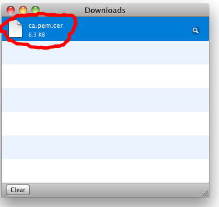
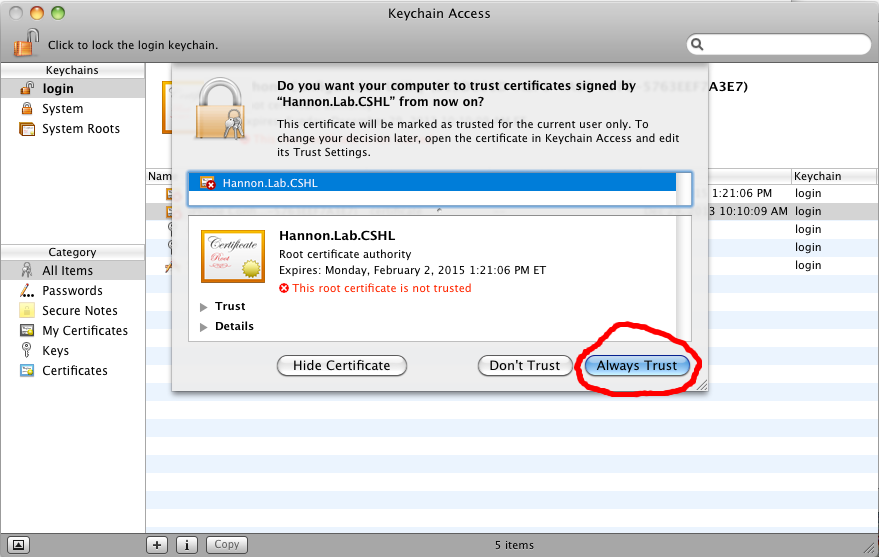
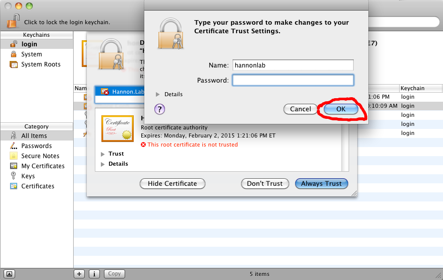

# Adding Root-CA certificate to Mac OS X (for Safari/Chrom)

## Preparations

After creating the Root CA certificate (with `./create_certificate_authority.sh`),
give the generated certificate file (`ca_public_certificate.pem`) to the clients' devices
(by email attachment or providing a downloadable link).

## Installation

### Installation Step 1 - Open Certificate File

Double click the certificate file to open the **Keychain** progarm:

### Installation Step 2 - Approve Certificate

Click **Always Trust**:

### Installation Step 3 - Admin Password

Enter your administrator password and click **OK**

The certificate is now installed.

Close the **keychain** program.

## Removal

TODO

## Security Considerations

* Installing (and trusting) any certificate enables all sorts of nasty tricks (e.g man-in-the-middle attacks). This should not be done lightly.
