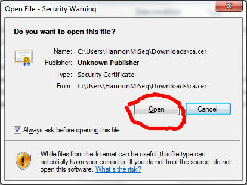
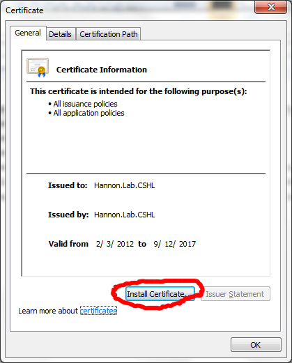
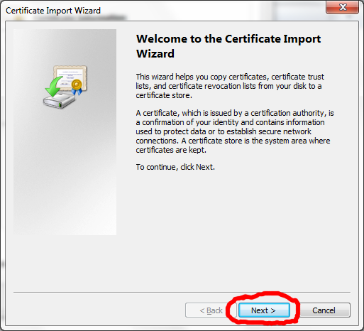
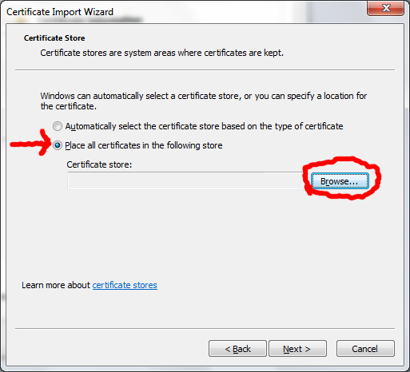
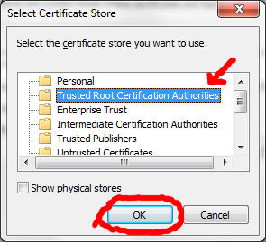
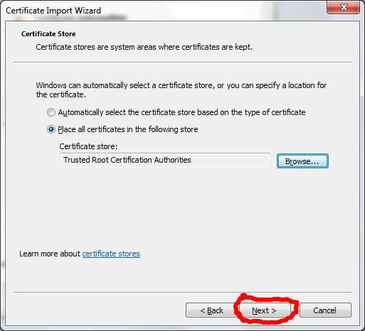
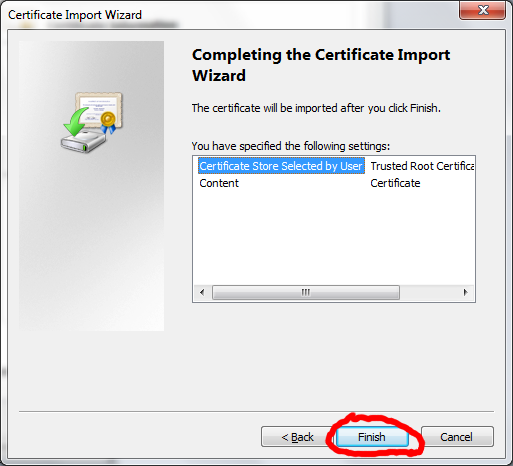
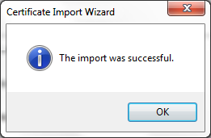

# Adding Root-CA certificate to Windows 7 (IE/Chrom)

## Preparations

After creating the Root CA certificate (with `./create_certificate_authority.sh`),
give the generated certificate file (`ca_public_certificate.pem`) to the clients' devices
(by email attachment or providing a downloadable link).

## Installation

### Installation Step 1 - Open Certificate File

### Installation Step 2 - Install Certificate File

Click **Install Certificate**:

### Installation Step 3 - Follow Installation Wizard Program

Click **Next**:

Select **"Place all certificates in the following store"** and click **Browse**:

Select **Trusted Root Certificate Authorities**, and click **OK**:

The wizard should look like this. Click **Finish**:

The certificate is now installed.

## Removal

TODO

## Security Considerations

* Installing (and trusting) any certificate enables all sorts of nasty tricks (e.g man-in-the-middle attacks). This should not be done lightly.
